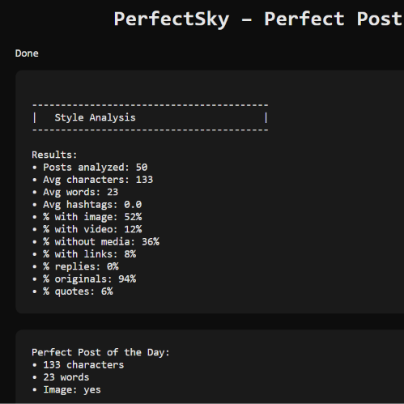

# PerfectSky – Perfect Post

### Web App  
https://bunesky.github.io/perfectsky-perfect-post/

### Preview  

PerfectSky Perfect Post analyzes the posts from the Bluesky Trending feed and shows:

- Key style metrics  
- Media usage patterns  
- Post type distribution  
- The automatically calculated “Perfect Post” based on majority trends  

### Feed Source  
https://bsky.app/profile/did:plc:jlyxq2frdkpnkwhzldvmjlrv/feed/aaadxgnfze66k

### Related Projects  
• Web app (analytics): https://bunesky.github.io/perfectsky-post/  
• Bot: https://github.com/Bunesky/perfectsky-post-bot  

### Contact  
https://bsky.app/profile/bune.bsky.social

---

